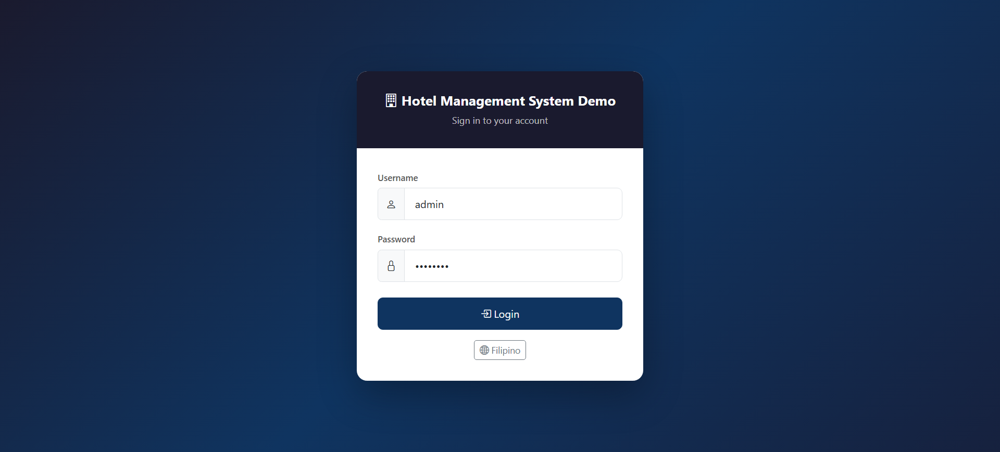
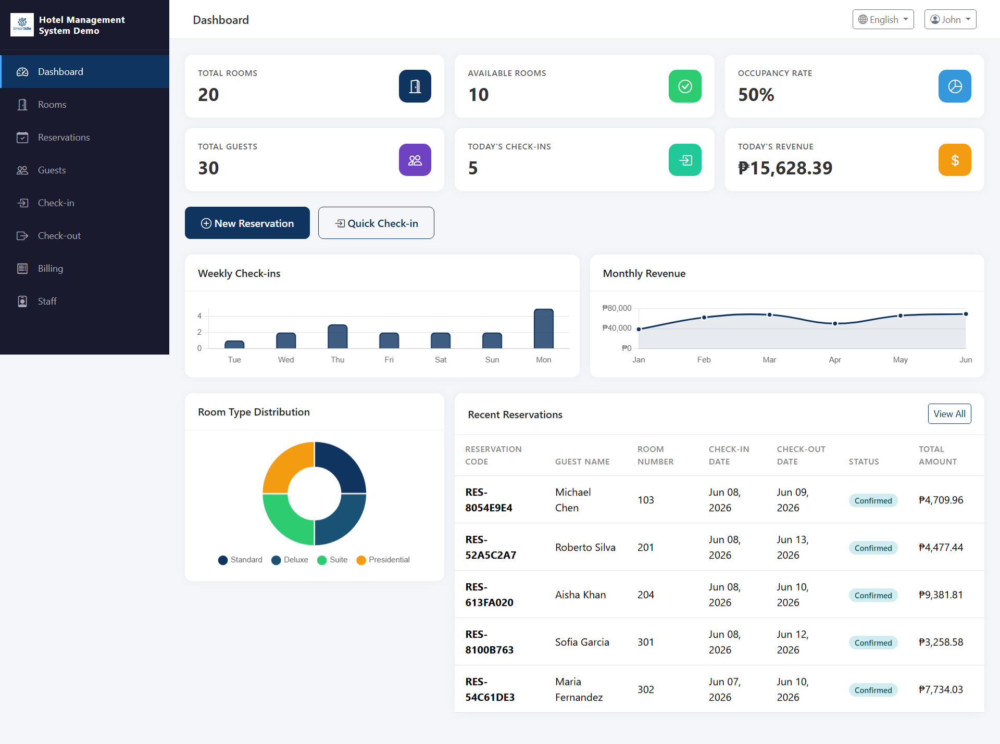
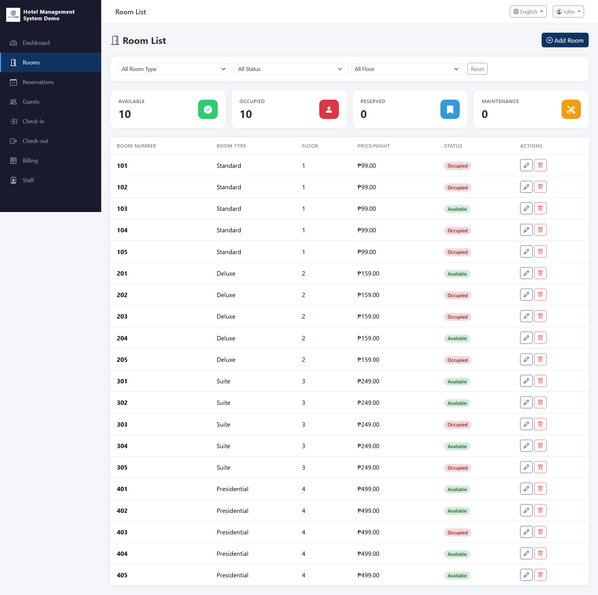
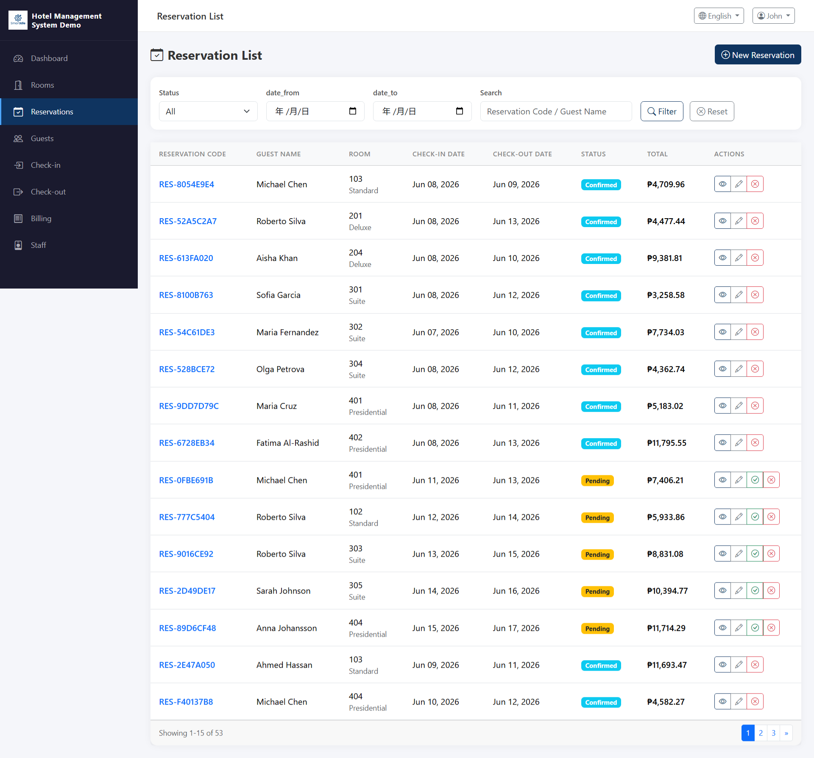
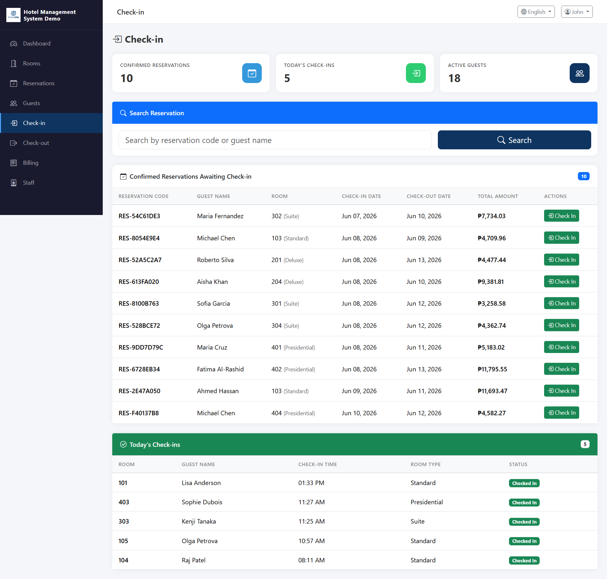

# Hotel Management System Demo

A full-featured hotel management system built with PHP, SQLite/MySQL, Bootstrap 5, and Chart.js. Designed as a demo application showcasing real-world CRUD operations, AJAX navigation, role-based access control, and interactive dashboards.


---

## Features

- **Dashboard** — Real-time statistics with animated counters and interactive charts (weekly check-ins, monthly revenue, room type distribution)
- **Calendar** — Visual scheduling of reservations with daily/weekly/monthly views
- **Room Management** — Manage rooms, room types, and housekeeping schedules
- **Reservations** — Full booking lifecycle: create, confirm, check-in, check-out, cancel
- **Guest Management** — Guest profiles with contact info, ID details, VIP status
- **Check-in / Check-out** — Streamlined front desk operations
- **Billing** — Auto-generated invoices with room charges, extras, tax, and discount support
- **Payments** — Multi-method payment tracking (cash, credit card, bank transfer, online)
- **Reports & Analytics** — Revenue trends, occupancy rates, top rooms by revenue (12-month view)
- **Staff Management** — User accounts with role-based access (Admin / Staff)
- **Multi-language** — English and Filipino (i18n-ready)
- **AJAX Navigation** — SPA-like experience with smooth page transitions, no full page reloads

## Screenshots

| Login | Dashboard |
|-------|-----------|
|  |  |

| Rooms | Reservations |
|-------|-------------|
|  |  |

| Check-in | Bill Details |
|----------|-------------|
|  |  |

## Tech Stack

| Layer | Technology |
|-------|-----------|
| Backend | PHP 8.2+ (no framework) |
| Database | SQLite (demo) / MySQL 8.0+ (production) |
| Frontend | Bootstrap 5.3, Bootstrap Icons |
| Charts | Chart.js 4.4 |
| Auth | Session-based with bcrypt password hashing |
| Architecture | MVC-inspired with modular structure |

## Prerequisites

- **PHP 8.2+** with SQLite3 extension enabled
- **MySQL 8.0+** (optional, for production setup)
- A modern web browser

## Quick Start (SQLite — Demo)

### 1. Clone the repository

```bash
git clone https://github.com/smartidle/Hotel-Management-System.git
cd Hotel-Management-System
```

### 2. Start the PHP built-in server

```bash
php -S localhost:8000
```

Or double-click `start.bat` on Windows.

### 3. Open your browser

Navigate to [http://localhost:8000](http://localhost:8000)

### 4. Login

| Role | Username | Password |
|------|----------|----------|
| Admin | `admin` | `admin123` |
| Staff | `staff` | `staff123` |

The SQLite database is automatically initialized on first run with sample data.

## MySQL Setup (Production)

1. Create a MySQL database:
   ```sql
   CREATE DATABASE hotel_management CHARACTER SET utf8mb4 COLLATE utf8mb4_unicode_ci;
   ```

2. Import the schema:
   ```bash
   mysql -u root -p hotel_management < database/hotel_management.sql
   ```

3. (Optional) Import seed data:
   ```bash
   mysql -u root -p hotel_management < database/seed.sql
   ```

4. Update `config/database.php` with your MySQL credentials.

## Project Structure

```
Hotel-Management-System/
├── api/                    # Shared API endpoints
│   ├── dashboard_stats.php
│   └── language.php
├── assets/
│   ├── css/style.css       # Custom styles
│   ├── img/                # Images and logo
│   └── js/                 # JavaScript modules
│       ├── ajax-nav.js     # AJAX navigation core
│       ├── app.js          # Global utilities
│       ├── billing.js
│       ├── checkinout.js
│       ├── dashboard.js
│       ├── reports.js
│       ├── reservations.js
│       ├── rooms.js
│       └── staff.js
├── config/
│   ├── app.php             # App configuration
│   ├── constants.php       # System constants
│   └── database.php        # DB connection
├── database/
│   ├── hotel_management.sql  # MySQL schema
│   └── seed.sql              # MySQL seed data
├── docs/                   # Documentation
├── includes/
│   ├── auth_check.php      # Session authentication
│   ├── functions.php       # Helper functions
│   ├── header.php          # HTML head + sidebar
│   ├── footer.php          # Scripts + closing tags
│   ├── navbar.php          # Top navigation bar
│   └── sidebar.php         # Side navigation menu
├── lang/
│   ├── en.php              # English translations
│   └── fil.php             # Filipino translations
├── modules/
│   ├── billing/            # Billing & invoices
│   ├── calendar/           # Calendar view
│   ├── checkinout/         # Check-in / Check-out
│   ├── guests/             # Guest management
│   ├── housekeeping/       # Housekeeping schedule
│   ├── reports/            # Reports & analytics
│   ├── reservations/       # Reservation management
│   ├── rooms/              # Room management
│   ├── roomtypes/          # Room type configuration
│   ├── settings/           # System settings
│   └── staff/              # Staff management
├── screenshots/            # App screenshots
├── index.php               # Login page
├── dashboard.php           # Main dashboard
├── setup.php               # SQLite DB initializer
├── start.bat               # Windows quick-start script
├── php.ini                 # PHP config for development
└── README.md
```

## Database Schema

The system uses 11 tables with full referential integrity:

```
roles ──< staff
room_types ──< rooms
guests ──< reservations >── rooms
               reservations ──< check_ins
               reservations ──< bills ──< payments
                                  bills ──< extra_charges
staff ──< activity_logs
```

See [Database Design Document](docs/) for the complete schema, indexes, and constraint details.

## License

This project is licensed under the MIT License — see the [LICENSE](LICENSE) file for details.

## Acknowledgments

- [Bootstrap 5](https://getbootstrap.com/) — UI framework
- [Chart.js](https://www.chartjs.org/) — Data visualization
- [Bootstrap Icons](https://icons.getbootstrap.com/) — Icon library
- [PHP](https://www.php.net/) — Server-side language
